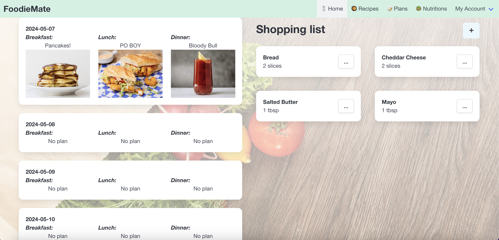
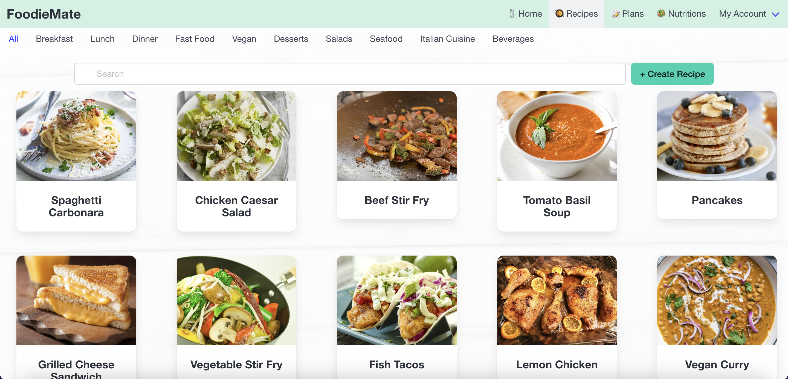
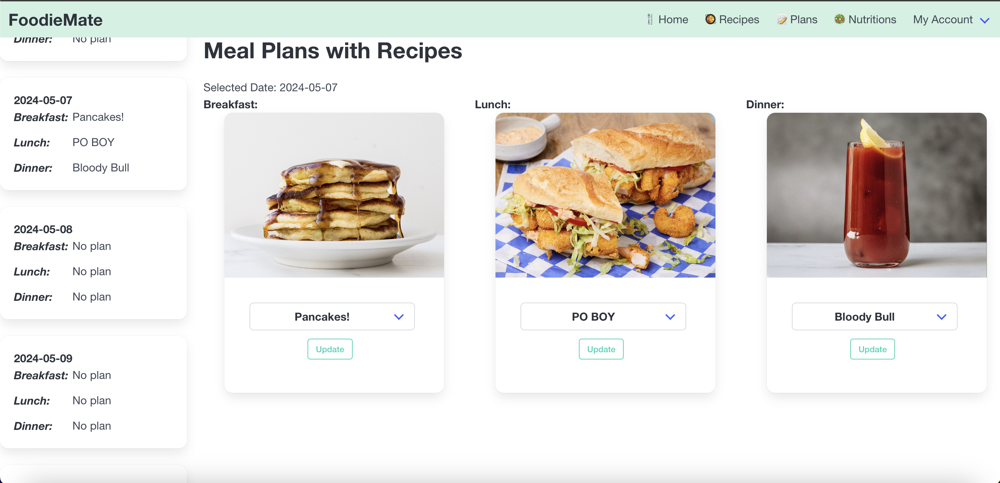
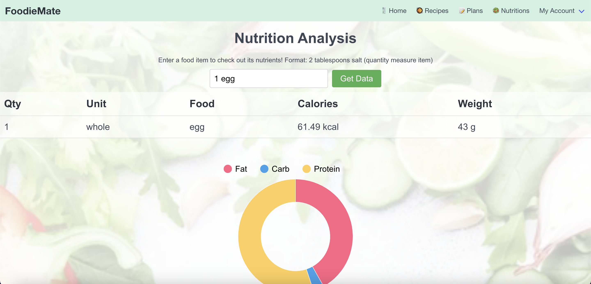
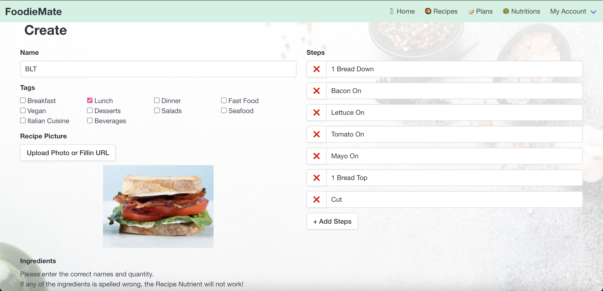
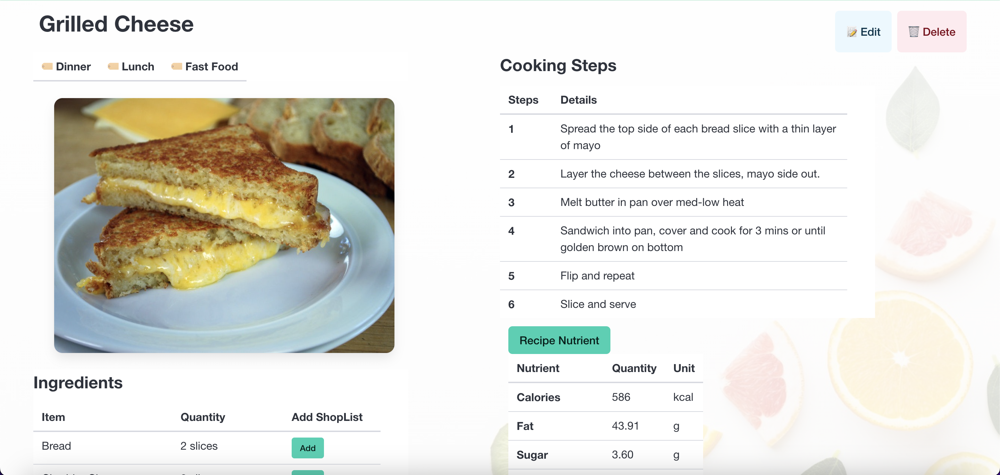

# FoodieMate

The second of two open-ended projects where I worked in a team of six to build and deploy a full-stack application. The only strict requirements given were a provided core tech stack and the goal for the app being to privately organize some information. The overall result for this project was an A :)

[FoodieMate](https://purple-coast-041010610.5.azurestaticapps.net/) (Link up as of 4/3/25, but login isn't available so can't do much)

## Overview

FoodieMate is an all-in-one food planner that manages ingredients, recipes, and weekly meals. 
Core features include: 
- recipe management with image and camera support (via [Cloudinary](https://cloudinary.com/))
- ingredient lists and tracking
- meal planning with existing user recipes
- nutrition calculater and displays for both ingredients and recipes (via [Edamam](https://www.edamam.com/) and [Google Charts](https://developers.google.com/chart))
- home screen install options to download the app to a device. 

The project is a serverless single-page application(SPA) built using React with React Router and the [Bulma](https://bulma.io/) CSS framework. User authentication and the NoSQL database used were provided and hosted by [Azure Cloud services](https://azure.microsoft.com/en-us/) and the project was hosted using the same. Serverless functions for data processing were created using [Azure Functions](https://learn.microsoft.com/en-us/azure/azure-functions/functions-overview) with Node.js.

## Mockup Images

### Home page

### User home page

### Recipe home page

### Create recipe page

### About recipe page

### Plans page

## Screenshots of Site

### Home Page
User shopping list and static display of meal plans.

### Recipes Page
View user's recipes under different categories along with a search. Can create new recipes from here or click on recipes to view details.

### Plans Page
Set mealplans using your recipes here. Can set breakfast/lunch/dinner for future days.

### Nutrition Page
Nutrition tool to get information on ingredients. Comes with table and graph information.

### Recipe Create
Create page for new recipes. Set names, tags, steps, ingredients, images. Image upload can be done using device camera.

### Recipe Details
Page for each recipe. Shows name, tags, steps, ingredients, and an image of the item (if provided). Also option to view nutrients of recipe given the ingredients. Can edit or delete recipe from this page.

